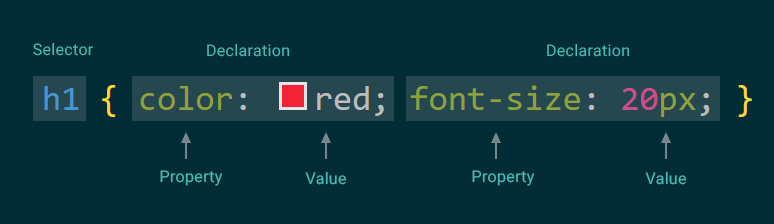
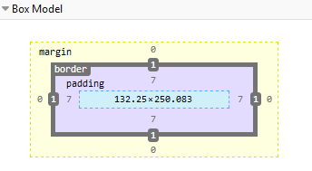
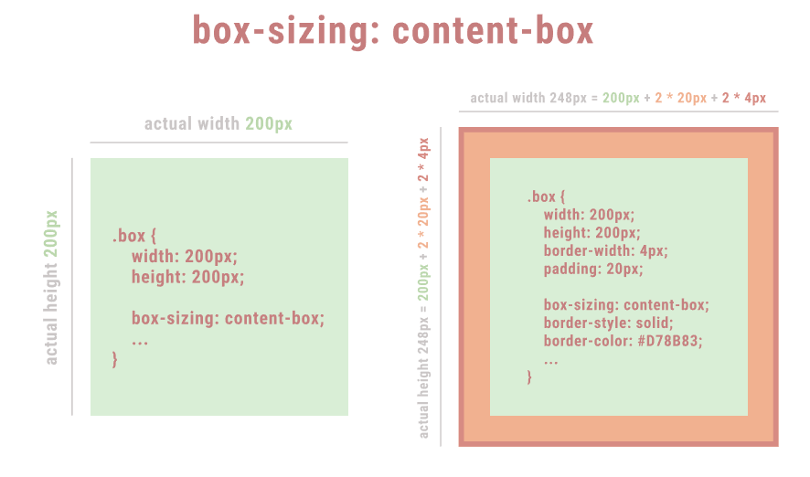
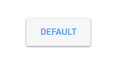

# CSS and SCSS Guide

## Inserting CSS [A]
There are 3 ways of inserting CSS.
#### [Inline] [A]
``` html
    <h1 style='color: red; font-size: 20px;'>Heading</h1>
```
#### [Internal] [A]
```html
    <head>
        <style>
            p {
                color: red;
                font-size: 20px;
            }
        </style>
    </head>
```
#### [External] [A]
```html
    <head>
        <link rel="stylesheet" type="text/css" href="mystyle.css">
    </head>
```

## Syntax [A]
A CSS rule-set consists of a selector and a declaration block.


## Selectors
A CSS selector is the part of a CSS rule set that shows which element (class, id,...) will be styled by the applied `property:value` declarations.

Selectors can be divided in these categories:
#### [Simple selectors] [A]
Match one or more elements based on element ``type``, ``class``, or ``id``.
```CSS
    p { color: red };
    .red-text { color: red };
    #red { color: red };
```

#### [[Pseudo-classes] [A]](https://developer.mozilla.org/en-US/docs/Web/CSS/Pseudo-classes)
Match states of elements, such as `:hover`, `:focus`, or their position in DOM tree: `:first-child`, `:last-child`...
```CSS
    p:hover { color: lightred };
    p:first-child { color: lightred };
```

#### [[Attribute selectors] [B]](https://developer.mozilla.org/en-US/docs/Web/CSS/Attribute_selectors)
Match one or more elements based on their attributes/attribute values. 
```CSS
    a[href="https://example.org"] {
        color: red;
    }
```
#### [[Pseudo-elements] [D]](https://developer.mozilla.org/en-US/docs/Web/CSS/Pseudo-elements)
Examples: `:after`, `:before`, `:first-line`...
```CSS
    p:after {
        content: '';
        position: absolute;
        left: 0;
        bottom: 0;
        height: 100%;
        background-color: red;
        width: 2px;
    }
```

#### [[Universal selectors] [B]](https://developer.mozilla.org/en-US/docs/Web/CSS/Universal_selectors) 
Selector `*` will match all elements.
```CSS
    .header * {
        color: red; /* every element inside header will have red color */
    }
```

#### [[Combinators] [C]](https://developer.mozilla.org/en-US/docs/Learn/CSS/Introduction_to_CSS/Combinators_and_multiple_selectors)
- **Adjacent sibling selectors** `.a + .b`
- **General sibling selectors** `.a ~ .b`
- **Child selectors** `.a > .b`
- **Descendant selectors** `.a .b`

#### [[Multiple selectors] [A]](https://developer.mozilla.org/en-US/docs/Learn/CSS/Introduction_to_CSS/Combinators_and_multiple_selectors#Groups_of_selectors_on_one_rule)
This type of selectors enables applying the same rule to multiple selected elements at once.
```CSS
    h1, h2, h3, h4, h5, h6 {
        color: red;
    }
```

<br />

📚 **Useful resources:**
- 📃 [Type of Selectors | CSS Working Group](https://drafts.csswg.org/selectors-3/)
- 📃 [Taming Advanced CSS Selectors | Smashing Magazine](https://www.smashingmagazine.com/2009/08/taming-advanced-css-selectors/)

## Specificity [A-D]
Imagine you have this content structure
```HTML
    <header class='header_container'>
        <h1 id='mainTitle' class='title'>
            Title
        </h1>
    </header>
```
and this CSS
```CSS
    .title {
        color: blue;
    };
    h1 {
        color: red;
    };
    #mainTitle {
        color: green;
    };
```
❓ Will **`h1`** be `blue`, `red` or `green`?

Before answering this, you have to understand how to calculate `CSS specificity`.
The amount of specificity is measured by four numbers, let's call them `thousands`, `hundreds`, `tens`,and `ones`.
- **Thousands** - this number is applied with `inline styles`, and it's `0` (when there is no inline style) or `1`.
- **Hundreds** - each `id` (#)` selector adds score `1`.
- **Tens** - each `class`, `pseudo-class` or `attribute` selector adds score `1`.
- **Ones** - each `element` selector adds score `1`. 

The higher selector specificity number will always win, and style inside that selector will be applied to the selected content.

For better understanding, see how calculating specificity works in our example.


Selector | Thousands | Hundreds | Tens | Ones | Calculated Specificity in Our Example
------------ | --- | --- | --- | --- | ------
h1 | 0 | 0 | 0 | 1 | <span style='color: #2c8eef'>0001 </span>❌
.title | 0 | 0 | 1 | 0 | <span style='color: darkred'>0010 </span>❌
#mainTitle | 0 | 1 | 0 | 0 | **<span style='color: #42bb79'>0100</span> ✔️**
inline style | 1 | 0 | 0 | 0 | 0000 (not applied in our example)


As we can see from the table, calculated specificity is the highest for `#mainTitle` selector, so our **`h1`** text will be `green`.

> ⚠️ **Notes** 
>
> - Universal selector (*), combinators (+, >, ~, ' ') and negation pseudo-class (:not) have no effect on specificity.
>
> - If multiple selectors have the same importance and specificity, which selector wins is decided by which comes later in the Source order.
>
> - [`!important`](https://developer.mozilla.org/en-US/docs/Web/CSS/Specificity#The_!important_exception) - adding this after CSS value wins over everything, even an inline style.

<br />

📚 **Useful resources:**
- 📃 [**CSS Specificity Wars | Stuff and Nonsense**](https://stuffandnonsense.co.uk/archives/css_specificity_wars.html) MUST SEE
- 📃 [How is Specificity Calculated? | MDN](https://developer.mozilla.org/en-US/docs/Web/CSS/Specificity#The_!important_exception)
- 📃 [Cascade and Inheritance | MDN](https://developer.mozilla.org/en-US/docs/Learn/CSS/Introduction_to_CSS/Cascade_and_inheritance)
- 📃 [CSS Specificity: Things You Should Know | Smashing Magazine](https://www.smashingmagazine.com/2007/07/css-specificity-things-you-should-know/)
- ❔ [Specificity Quiz](https://mjswensen.github.io/css-power-ups/the-cascade-and-specificity/specificity-quiz/)

## [Inheritance] [B]
Some CSS properties are inherited from containers. For example, child element will have the same `color` and `font` as its container, if not specified otherwise.

<br />

📚 **Useful resources:**
- 📃 [List of Inherited CSS Properties](https://gist.github.com/dcneiner/1137601)
- 📃 [CSS Inheritance: An Introduction](https://www.sitepoint.com/css-inheritance-introduction/)

## [Values] [A-F]
- Textual
    - Pre-defined values (flex-direction: `column`)
    - CSS-wide values (accepted by all CSS properties - `inherit`, `initial`, and `unset`)
    - URLs (absolute or relative)
- Numeric 
    - Integer [A]
    - Numbers [A]
    - Dimensions (`12px`, `1.2em`, `90deg`)
        - Distance 
            - Relative [A]: `em`, `%`, `vw`...
            - Absolute [A]: `px`, `cm`, `pt`,...
        - Angle [E]: `deg`, `grad`,...
        - Time [D]: `s`, `ms`
        - Frequency [E]: `Hz`, `kHz`
        - Resolution [E]: `dpi`, `dpcm`, `dppx`, `x`
    - Percentages [A]
    - Mixing percentages and dimensions [F]
- Color [C]
- Image [B]
- Position [C]
- Functional notation [D] (`calc()`, `min()`, `max()`,...)

<br />

📚 **Useful resources:**
- 📃 [CSS Values and Units | MDN](https://developer.mozilla.org/en-US/docs/Web/CSS/CSS_Values_and_Units)
- 📃 [CSS Values | W3 Resource](https://www.w3resource.com/css/CSS-values.php)

### [Shorthand Properties] [A-E]
Most common properties that are usually written shorthand:
- Border properties [A]
    ```CSS
    .bordered_container {
        /* shorthand */
        border-width: 1px;
        /* is the same as */
        border-top-width: 1px;
        border-right-width: 1px;
        border-bottom-width: 1px; 
        border-left-width: 1px;
    }
- Margin [A]
- Padding [A]
- Background [D]
- Font [D]
- Transition [E]

#### [Reading Shorthand] [A]
Shorthands handling properties related to edges of a box, like `border-width`, `margin` or `padding`, always use a consistent 1-to-4-value syntax representing those edges:

Shorthand | Reading |
---------------- | ------------------ | 
border-width: 1px; | | 
border-width: 1px 2px; |  |
border-width: 1px 2px 3px; |  |
border-width: 1px 2px 3px 4px; (read clockwise)  |  

*Images taken from [MDN]('https://developer.mozilla.org/en-US/docs/Web/CSS/Shorthand_properties')*

<br />

>⚠️ **Warning** 
>
> It's [not recommended](https://developer.mozilla.org/en-US/docs/Web/CSS/Shorthand_properties#Tricky_edge_cases) to use shorthands for more complicated properties, such as `background`. Use `background-color`, `background-image`, `background-size`... instead.

<br />

📚 **Useful resources:**
- 📃 [Shorthand Properties | MDN](https://developer.mozilla.org/en-US/docs/Web/CSS/Shorthand_properties)

<br />

## Properties

When you begin with CSS, you probably start playing with properties that are easy to understand, colors - `color`, `background-color`, `border-color`, or fonts - `font-size`, `font-family`. And they usually work as expected.


The second step would probably be to modify `width`, `height`, `margin`, `padding`, and this is where most CSS beginners encounter their first frustrations. This is because they probably skipped one of the most important CSS concepts - `box model`.

### [Box Model] [A]
- width [A]
- height [A]
- padding [A]
- margin [A]
- border-width [A]
- box-sizing [A]
- background-clip [D]

The [`CSS box model`](https://developer.mozilla.org/en-US/docs/Learn/CSS/Introduction_to_CSS/Box_model) is the foundation of layout on the Web — each element is represented as a rectangular box, with the box's `content`, `padding`, `border`, and `margin` built up around one another like the layers of an onion.



The layers are easy to understand, but what's usually causing confusion is `box-sizing` property.

#### [Box sizing] [A]
- content-box
- **border-box**

If a container has `width: 200px`, and also `padding: 20px` and `border-width: 4px`, it will 'grow' to  `248px` which equals 200px (*width*) + 2 * 20px (*left and right padding*) + 2 * 4px (*left and right border width*). This is because default `box-sizing` value is `content-box`.  

If we set `box-sizing: border-box`, the actual width will be the expected `200px`.

Box sizing behaviour is explained in these images.




>
>⚠️ **Note** 
> 
> `padding-box` is not used anymore.
>

<br />

📚 **Useful resources:**
- Box Model and Sizing
    - 📃 [Box Model | MDN](https://developer.mozilla.org/en-US/docs/Learn/CSS/Introduction_to_CSS/Box_model)
    - 📃 [Box Sizing | MDN](https://developer.mozilla.org/en-US/docs/Web/CSS/box-sizing)
    - 📃 [Box Sizing | CSS Tricks](https://css-tricks.com/box-sizing/)
    - 📃 [Box Model | Learn Layout](https://learnlayout.com/box-model.html)

- Fonts
    - 📃 [Working with Typography | Shay Howe](https://learn.shayhowe.com/html-css/working-with-typography/)
- Colors
    - 📃 [CSS Color Module | CSS Working Group](https://drafts.csswg.org/css-color-3/)
    - 📃 [A Nerd’s Guide to Color on the Web | CSS Tricks](https://css-tricks.com/nerds-guide-color-web/)
    - 📃 [Color Value | MDN](https://developer.mozilla.org/en-US/docs/Web/CSS/color_value)
- Background
    - 📃 [Background | MDN](https://developer.mozilla.org/en-US/docs/Web/CSS/background)
    - 📃 [Background Position | CSS Tricks](https://css-tricks.com/almanac/properties/b/background-position/)
    - 📃 [Background Size | MDN](https://developer.mozilla.org/en-US/docs/Web/CSS/background-size)
    - 📃 [Background Size | CSS Reference](https://cssreference.io/property/background-size/)

## Layout
Once you've understood how box model and `box-sizing` works, you're at least able to set absolute width and height of the element.

When it comes to CSS, the most common cause of problems is the **layout**. Element positioning, vertical or horizontal alignment, overflow, z-index can be hard to grasp for CSS beginners.

- Position
    - #### [static] [B]
    - #### [relative] [A]
    - #### [absolute] [A]
    - #### [fixed] [A]
    - #### [sticky] [D]
- Display
    - #### [inline] [A]
    - #### [inline-block] [A]
    - #### [block] [A]
    - #### [flexbox] [C]
    - #### [grid] [D]
    - #### [table] [D]
- [z-index] [C]
- [float] [D]
- [vertical-align] [A]
- [text-align] [A]

<br />

>
>⚠️ **Warning** 
> 
> [Do not use](https://stackoverflow.com/questions/9776840/are-floats-bad-what-should-be-used-in-its-place) `floats` for layout. "*They’re simply meant to take an element, put it to one side, and let other content flow around it. That’s all.*" Use `flexbox` and `grid` instead.

>*The float CSS property places an element on the left or right side of its container, allowing **text and inline elements** to wrap around it.* - MDN
>

Since it would take too long to explain all these properties, here are some learning resources.

<br />

📚 **Useful resources:**
- 📃 **[CSS Layout | Learn Layout](https://learnlayout.com/no-layout.html)**
- 📃 [Layout | Magic of CSS](https://adamschwartz.co/magic-of-css/chapters/2-layout/)

- Position

    - 📃 [Position | CSS Tricks](https://css-tricks.com/almanac/properties/p/position/)
    - 📃 [How to Use Position to Align Elements | Free Code Camp](https://www.freecodecamp.org/news/how-to-use-the-position-property-in-css-to-align-elements-d8f49c403a26/)
    - 📃 [Advanced Positioning | Interneting is Hard](https://internetingishard.com/html-and-css/advanced-positioning/)
    - 📃 [Sticky Postion | Elad Schechter](https://medium.com/@elad/css-position-sticky-how-it-really-works-54cd01dc2d46)
- Display

    - 📃 [Understanding CSS Display | Better Programming](https://medium.com/better-programming/understanding-css-display-none-block-inline-and-inline-block-63f6510df93)
-  Flexbox

    - 📹 **[Flexbox Tutorial | Scrimba / Per Harald Borgen](https://scrimba.com/g/gflexbox)**
    - 📹 [Flexbox Tutorial | Wes Bos](https://flexbox.io/)
    - 📃 **[A Guide to Flexbox | CSS Tricks](https://css-tricks.com/snippets/css/a-guide-to-flexbox/)**
    - 📃 [The Complete Illustrated Flexbox Tutorial | Free Code Camp](https://www.freecodecamp.org/news/the-complete-illustrated-flexbox-tutorial-d35c085dbf35/)
    - 📃 [Understanding Flexbox: Everything You Need To Know | Free Code Camp](https://medium.com/free-code-camp/understanding-flexbox-everything-you-need-to-know-b4013d4dc9af)
    - 🎮  [Flexbox Game | Flexbox Froggy](https://flexboxfroggy.com/)
- Grid
    - 📹 **[Grid Tutorial | Scrimba / Per Harald Borgen](https://scrimba.com/g/gflexbox)**
    - 📹 [Grid Tutorial | Wes Bos](https://courses.wesbos.com/account/access/5d41a44985f96c03c1e50f80)

- Z-index
    - 📃 [The Z-Index CSS Property: A Comprehensive Look | Smashing Magazine](https://www.smashingmagazine.com/2009/09/the-z-index-css-property-a-comprehensive-look/) 
    
## [Transition] [D]

Property `transition` is a shorthand for:
-  `transition-property` (***all***, *color*, *box-shadow*, *background-color*, ...)
- `transition-duration` (*200ms*, *0.2s*, ...)
-  `transition-timing-function` (***ease***, *linear*, *steps(4, end)*,  *cubic-bezier(0.4, 0.0, 1, 1)*, ...)
- `transition-delay` (*200ms*, *0.2s*, ...)


You can use both `transition` and `animation` property to add animation effect to an element.

The main difference between the two is that `transition` effect works only when an element changes its state (*:hover*, *:focus*, *:active*, ...), or when it's added to the page, or when it 'gets' or 'loses' a class. Also, `transition` only visualizes property change from a beginning state to an ending state.

For example, in material design, when you press a button (`:active` state), it seems like you're lifting it gradually. This effect is achieved by the `transition` property, which slowly changes button background-color and box-shadow. 

```CSS
    .cxb-button {
        background-color: #f6f6f6;
        box-shadow: 0 1px 3px rgba(0, 0, 0, 0.45);

        transition: all 0.2s ease-out 0;
        /*
            transition-porperty: all; (in this case, background-color and box-shadow)
            transition-duration: 0.2s;
            transition-timing-function: ease-out;
            transition-delay: 0; (it's not necessary to set it to 0)
        */
        ...
    };
    .cxb-button:active {
        background-color: #eeeeee;
        box-shadow: 0 4px 8px rgba(0, 0, 0, 0.3);

        transition: all 0.2s ease-out 0;
        /*
            transition-porperty: all; (in this case, background-color and box-shadow)
            transition-duration: 0.2s;
            transition-timing-function: ease-out;
            transition-delay: 0; (it's not necessary to set it to 0)
        */
        ...
    };
```


<br />

> 
> ⚠️ **Note**
>
> You can't apply transition to all CSS properties. See the list of [animatable CSS properties](https://developer.mozilla.org/en-US/docs/Web/CSS/CSS_animated_properties).

<br />

📚 **Useful resources:**
- 📃 **[Using CSS Transitions | MDN](https://developer.mozilla.org/en-US/docs/Web/CSS/CSS_Transitions/Using_CSS_transitions)**
- 📃 [Animatable CSS properties | MDN](https://developer.mozilla.org/en-US/docs/Web/CSS/CSS_animated_properties)
- 📃 [transition-timing-function | CSS Tricks](https://css-tricks.com/almanac/properties/t/transition-timing-function/)
- 📃 [transition-timing-function | MDN](https://developer.mozilla.org/en-US/docs/Web/CSS/transition-timing-function)
- 📃 [Advanced Transitions | Magic of CSS](https://adamschwartz.co/magic-of-css/chapters/6-transitions/)
- 📃 [Creative Link Effects Magic | Tympanus](https://tympanus.net/Development/CreativeLinkEffects/)
- 📃 [Sidebar Transitions | Tympanus](https://tympanus.net/Development/SidebarTransitions/)

## [Animation] [D]
Unlike the effects set by `transition` property, `animation` effects don't need a trigger (hover, active,...) to run. They can happen automatically (on page load, for example).

Also, with `animation` you can set countless states between a start and an end state, or even loop animation. `transition` lets you style the appearance of an element only at the beginning of animation and at its end.

So, if you need an animation to run when the page loads, or you have an animation more complex than a simple A to B state change, it is recommended to use the `animation` property.

[MDN] defines animations as *shorthand CSS property that applies an animation between styles*. It is a shorthand for:
- **`animation-name`**
- **`animation-duration`**
- **`animation-timing-function`**
- **`animation-delay`**
- `animation-iteration-count`
- `animation-direction`
- `animation-fill-mode`
-  `animation-play-state`

It is important to understand that you don't configure the actual animation effect with `animation` property. It is done with `@keyframes`. Once you define effects with `@keyframes`, you can use them through `animation-name`.

```CSS
    .animated_container {
        height: 100px;
        background-color: red;
        animation: changeWidth 3s ease-in 0s infinite;
        ...
        /*
            animation-name: changeWidth;
            animation-duration: 3s;
            animation-timing-function: ease-in;
            animation-delay: 0s;
            animation-iteration-count: infinite;
        */
    };

    @keyframes changeWidth {
        0% {
            width: 50px;
        }
        50% {
            width: 100px;
        }
        100% {
            width: 150px;
        }
    };

    /* if there are only two frames - 0% and 100%, you can also write it like this */
    @keyframes changeWidth {
        from {
            width: 50px;    
        }
        to {
            width: 150px;    
        }
    }
```


<br />

📚 **Useful resources:**
- 📃 [Transitions VS Animations | CSS Animation Rocks](https://cssanimation.rocks/transition-vs-animation/)
- 📃 **[CSS Animation For Beginners | Thought Bot](https://thoughtbot.com/blog/css-animation-for-beginners)**
- 📃 [Advanced CSS Animation Property - animation-direction | MDN](https://developer.mozilla.org/en-US/docs/Web/CSS/animation-direction)
- 📃 [Advanced CSS Animation Property - animation-fill-mode | MDN](https://developer.mozilla.org/en-US/docs/Web/CSS/animation-fill-mode)
- 📃 [Advanced CSS Animation Property - animation-play-state | MDN](https://developer.mozilla.org/en-US/docs/Web/CSS/animation-play-state)
- 📃 [Material Design Motion | Google Material Design](https://material.io/design/motion/speed.html#easing)
- 📐 **[Best CSS Animation Library | Animista](http://animista.net/)**

